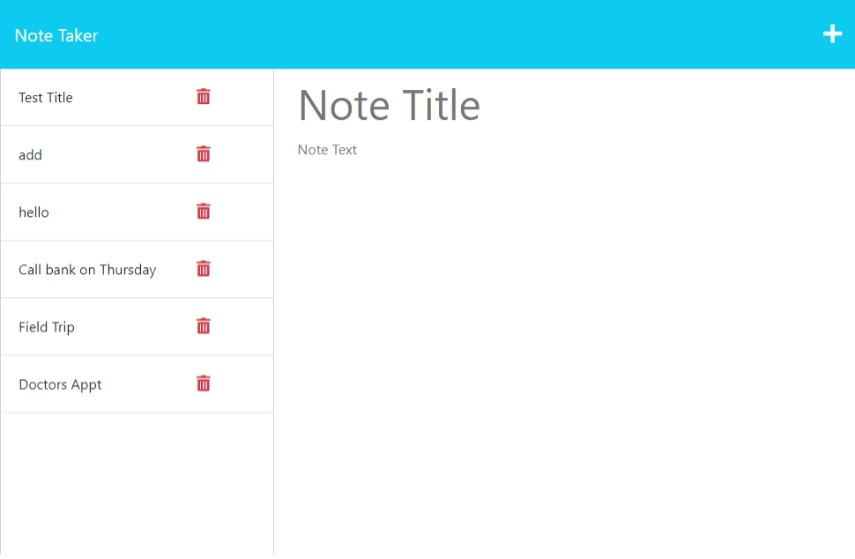

# Note-Taker

## Description
This application you can create and save notes using a server called express.js.

# Table of Contents

 * [Installation](#installation)
 * [Usage](#usage)
 * [License](#license)
 * [Contributing](#contributing)
 * [Questions](#questions)
    

## Installation

Go to repo at https://github.com/Mrose332/Note-Taker.git then run npm install, then find the server file by running node server.js, then go to 'localhost:3001' to see it deployed.

## License
Project is license under MIT

## Usage 

## Contributing 

Under Installation section

## Questions

Reach me for additional questions at: mailto:mrose332@gmail.com.

To view deployed project at:.
